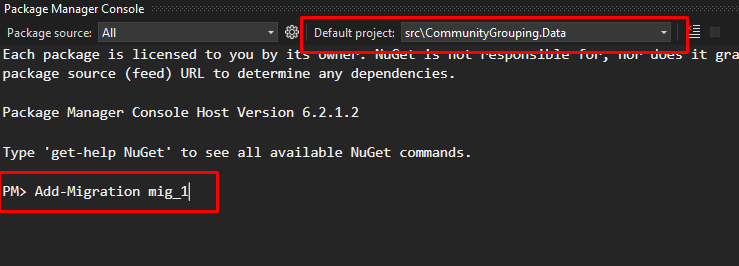

# Crea Readme

# **Technologies &  Framework**

- .Net 6.0  WebAPI
- Entity Framework Core 6.0
- PostgreSQL
- Redis
- Serilog
- Swagger
- Fluent Validation
- Fluent Assertions
- EF.Extension (For Bulk Operations)
- CsvHelper (For Bulk Operation)

## Task

A restful .net core API must be implemented for the community grouping project and must have
a swagger page that shows request and response data transfer objects. No front-end is needed.
Only the swagger documentation will be used for testing. API must support the following
operations;

- [x]  Create a person entry with the following information
- [x]  Edit a person entry
- [x]  Delete a person entry
- [x]  Import a csv file for bulk creating person entries
- [x]  Search, order and paginate person entries
- [x]  Create a community group with a community name
- [x]  Edit a community group name
- [x]  Delete a community group
- [x]  Assign users to a community group
- [x]  Remove users from a community group
- [x]  Return a community group with the people contained in it
- [x]  Users can register and log in with email and password
- [x]  People and community groups must belong to the logged-in user
Technical Requirements

### Nice to Haves

- [x]  Adding unit and e2e tests
- [ ]  Adding person entries to a selected community group while importing a csv
- [ ]  Bulk deleting person entries
- [ ]  Automatic grouping of persons to communities by Occupation. For example,
when a new person is added with an Occupation, the person will be assigned to
that community group. If the group doesn’t exist, it will be created.
- [ ]  Giving users a way of extending the person attributes. For example, the base
person object doesn’t have Phone and Birthday entries, but user A wants to add
Phone information to its persons, and user B wants to add Birthday information to
its persons.

### Deliverables

- [x]  An API with swagger documentation that requires authentication for its endpoints, except
the register endpoint.
- [x]  The project must be deployed to a public GitHub repository.
- [x]  The GitHub repository should contain a ReadMe file containing information about
installing and running your project and the required environment

## **Getting Started**

### ****Database Configuration****

If you would like to use PostgreSQL, you will need to update **CommunityGrouping.API/appsettings.json** as follows:

```csharp
"ConnectionStrings": {
    "DefaultConnection": "Host=localhost;Port=5432;Database=communityGroupingDb;Username=postgres;Password=root"
  },
```

### ****Database Migrations****

Open the Package Manager Console. Choose `**CommunityGrouping.Data**` as the default project. After typing the migration add command, update the database with the `update-database` command.



### Redis Configuration

Person pagination uses Redis cache. Edit Redis configuration **CommunityGrouping.API/appsettings.json** as follows;

```csharp
"Redis": {
    "Host": "localhost",
    "Port": "6379",
    "InstanceName": "communityGroupingCache"
  }
```

# **Swagger Screenshots**

## Login Endpoint

### Request


### Response


---

## Register Endpoint

### Request


### Response


---

## Person Pagination Endpoint

### Request


### Response


---

## Add Person Endpoint

### Request


### Response


---

## Person Get By Id Endpoint

### Request


### Response


---

## Person Update Endpoint

### Request


### Response


---

## Person Delete Endpoint

### Request


### Response


---

## Person Bulk Insert Endpoint

### Request


### Response


---

## Person Add To Community Group Endpoint

### Request


### Response


---